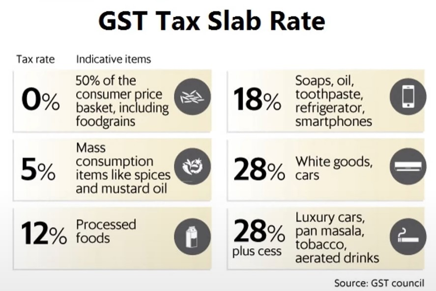
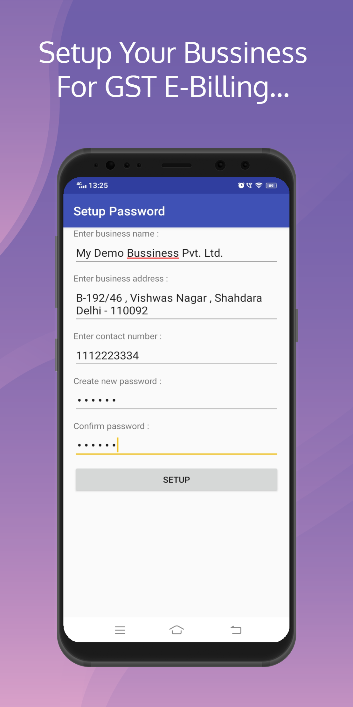
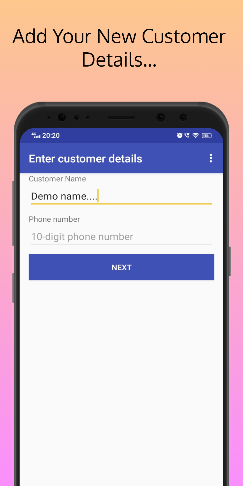
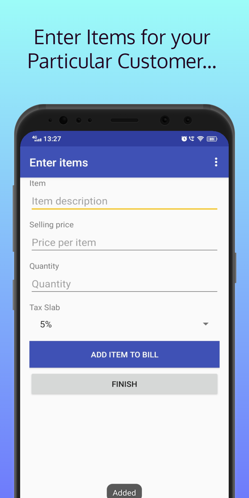
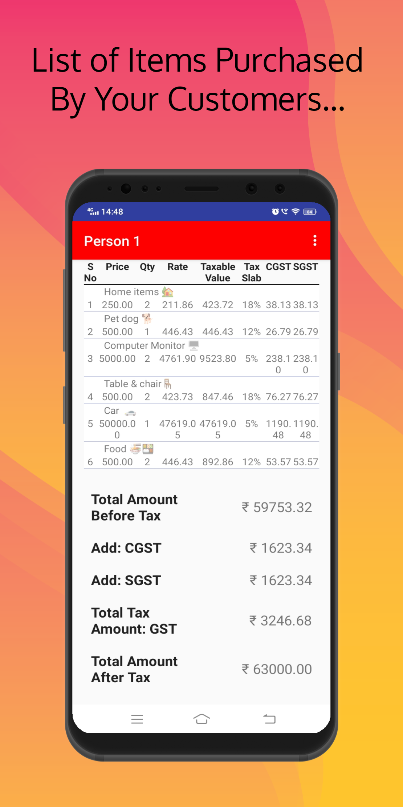
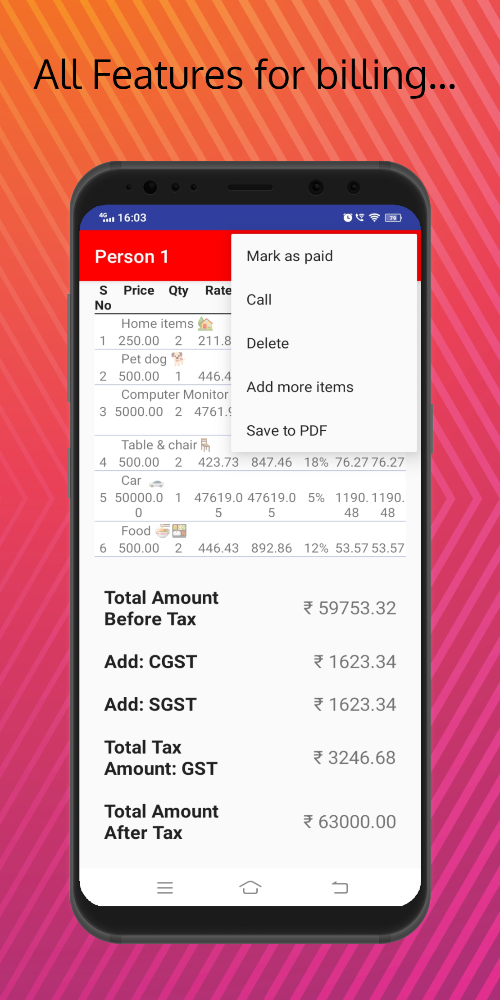
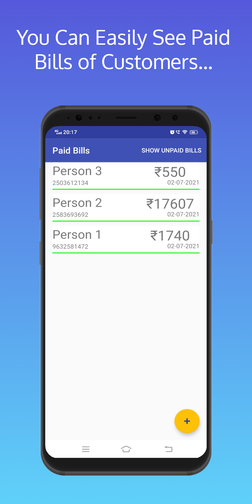
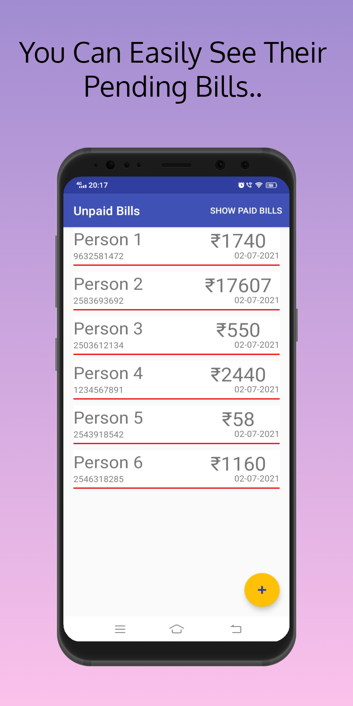
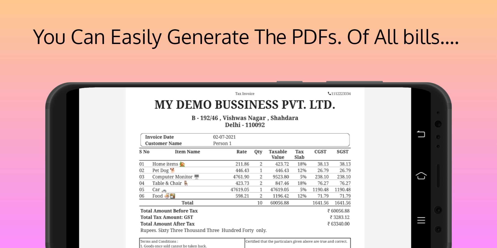

## GST-E-Billing-App

**Description** : Android GST E-Billing Project  is GST billing solution. The system enables you to _**add products and items**_, create _**customers**_ and _**users**_, and generate as many _**invoices**_, _**receipts**_ and _**quotes**_ as you want.  The system provides some other _**awesome** **features**_ which include instant _**invoice calculations**_ for _**items**_, _**quantity**_, _**Taxes**_ / _**VAT**_ and _**total**_ _without any extra effort_. I build this app in android Studio using _**SQlite database**_ and _**Java**_.

#### _Features :-_
* _Easy  Layout._  
* _Generate Invoices and receipts PDF Support_  
* _Unique bill numbers_  
* _Functionality to create invoice item each time or choose from database._  
* _Functionality to choose  TAX._  
* _Generate downloadable PDf  files_  
* _And lot more..._

#### _Technology, Tools and Plugin Used :-_
* _Android Studio_  
* _java_  
* _SQlite Database_  
* _Windows 10_  

---

### _Some Screenshots of all activities for Your Better & Quick Visualization_ ⬇

 Setup your business for GST E-Billing                               | Add your new customer details                                        
:------------------------------------------:|:-------------------------------------------:
  | 
 
 Enter items for your particular customer 			                    | List of items purchased by your customer
:-----------------------------------------------:|:----------------------------------------:
 |

 Add, Delete, Save pdfs, Mark as paid                           | Paid bills of customers                             
:-----------------------------------------:|:--------------------------------------------:
| 

 Pending bills of customers                       | Paid bills of customers
:-----------------------------------------------:|:-------------------------------------:
 |
 
| You can easily generate the PDFs of bills of all customers                                |
| :----------------------------------------------------------------------------------------:|
|                                           |  

**For further queries :Drop me mail at** hamzashahnawaz3440@gmail.com
 

